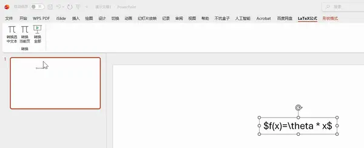

# LaTeX2Equation - PowerPoint LaTeX 公式转换插件

## 安装方法（使用者操作）

1. 将 `LaTeX2Equation.ppam` 保存到电脑上任意位置
2. 打开 PowerPoint → **文件** → **选项** → **加载项**
3. 底部 **管理** 下拉选 **PowerPoint 加载项** → 点 **转到**
4. 点 **添加** → 选择 `.ppam` 文件 → 确定
5. Ribbon 上会出现 **LaTeX公式** 选项卡，包含三个按钮

> **注意**：首次使用可能需要在 **信任中心** 启用宏：
> 文件 → 选项 → 信任中心 → 信任中心设置 → 宏设置 → 启用所有宏

## 使用方法

在文本框中用 `$...$` 或 `$$...$$` 包裹 LaTeX 公式，然后：

- **转换选中文本**：先选中含公式的文本，点击按钮
- **转换当前页**：自动处理当前幻灯片所有文本框
- **转换全部**：自动处理整个演示文稿

示例文本：`The equation $E=mc^2$ is famous.`

## 制作 .ppam 加载项（制作者操作）

### 第一步：创建带宏的演示文稿
1. 打开 PowerPoint，新建空白演示文稿
2. 按 `Alt+F11` 打开 VBA 编辑器
3. 左侧右键 **VBAProject** → **导入文件** → 选择 `LaTeX2Equation.bas`
4. 保存为 **PowerPoint 启用宏的演示文稿 (.pptm)**，命名为 `LaTeX2Equation.pptm`
5. 关闭 PowerPoint

### 第二步：注入 Ribbon XML
1. 下载 Office Custom UI Editor：
   https://github.com/fernandreu/office-ribbonx-editor/releases
2. 用 Custom UI Editor 打开 `LaTeX2Equation.pptm`
3. 右键文件名 → **Insert customUI14 part**
4. 将 `customUI14.xml` 的内容粘贴进去
5. 点击 **Validate**（确认无错误）→ **Save**
6. 关闭 Custom UI Editor

### 第三步：另存为 .ppam
1. 用 PowerPoint 重新打开 `LaTeX2Equation.pptm`
2. **文件** → **另存为** → 文件类型选 **PowerPoint 加载项 (*.ppam)**
3. 文件名：`LaTeX2Equation`，保存（路径会自动跳到 AddIns 文件夹）

制作完成，将 `LaTeX2Equation.ppam` 分发给其他人即可。

---
